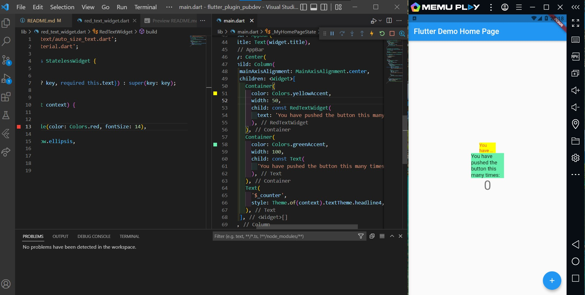
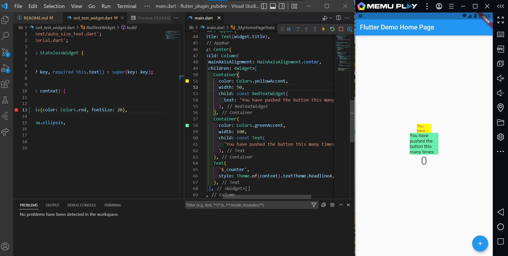
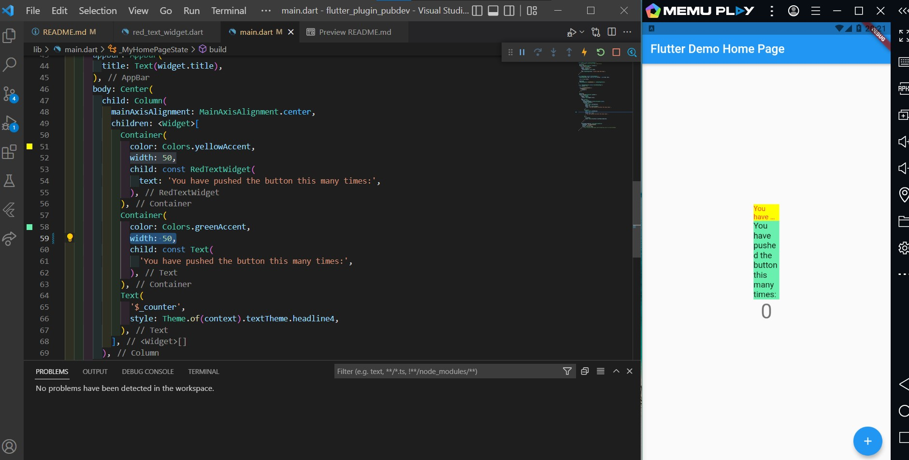

# flutter_plugin_pubdev

#22 | Pengenalan Plugin di Pub.Dev

## Langkah 2: Menambahkan Plugin

Tambahkan plugin `auto_size_text` menggunakan perintah berikut di terminal

## Langkah 3: Buat file red_text_widget.dart

Buat file baru bernama `red_text_widget.dart` di dalam folder lib 

## Langkah 4: Tambah Widget AutoSizeText

Ubahlah kode `return Container()` menjadi seperti berikut 
 
Terdapat error pada baris ke-8 karena method `AutoSizeText` tidak terdefinisi dan cara memperbaikinya yaitu dengan menambahkan `import 'package:auto_size_text/auto_size_text.dart';`. Lalu pada baris ke-9 error karena variabel `text` tidak terdefinisi dan akan diperbaiki pada langkah ke 5.

## Langkah 5: Buat Variabel text dan parameter di constructor

Tambahkan variabel text dan parameter di constructor seperti berikut 
 

## Langkah 6: Tambahkan widget di main.dart

Buka file `main.dart` lalu tambahkan di dalam `children:` pada class `_MyHomePageState` 
 

## Output

## Tugas Praktikum

2. Jelaskan maksud dari langkah 2 pada praktikum tersebut! 
   Langkah 2 menambahkan plugin yaitu package khusus yang menyediakan fungsi tertentu. Pada langkah ini menambahkan plugin `auto_size_text` yang berfungsi untuk mengubah ukuran teks secara otomatis agar sesuai atau pas dengan batasnya.
3. Jelaskan maksud dari langkah 5 pada praktikum tersebut! 
   Langkah 5 membuat variabel `text` dan parameter di constructor pada class `RedTextWidget`. Variabel `text` ini nantinya akan digunakan untuk menampung teks ketika widget RedTextWidget digunakan pada `main.dart`.
4. Pada langkah 6 terdapat dua widget yang ditambahkan, jelaskan fungsi dan perbedaannya!
   Terdapat 2 widget yaitu yang pertama widget untuk menampilkan teks dengan menggunakan widget `RedTextWidget` dan yang kedua untuk menampilkan teks dengan menggunakan widget `Text`. Perbedaannya yaitu pada widget pertama ukuran teks akan otomatis menyesuaikan batas lebar dari `Container()` dan `maxLines`, sedangkan pada widget kedua ukuran teks tidak bisa otomatis menyesuaikan.

   - Sebelum diubah
     

   - Mengubah `fontSize` dari `RedTextWidget` tetapi tidak mengubah lebar Container
     

   * Mengubah lebar Container dari widget `Text`
     

5. Jelaskan maksud dari tiap parameter yang ada di dalam plugin `auto_size_text` berdasarkan tautan pada dokumentasi ini ! 
   | Parameter | Penjelasan |
   | --------- | ---------- |
   | key* |mengontrol bagaimana satu widget menggantikan widget lain|
   | textKey | menyetel kunci untuk `Text` widget yang dihasilkan |
   | style* | mengatur gaya tulisan sama halnya di widget `Text` |
   | minFontSize | ukuran teks minimum yang akan digunakan saat mengubah ukuran teks secara otomatis|
   | maxFontSize | ukuran teks maksimum yang akan digunakan saat mengubah ukuran teks secara otomatis |
   | stepGranularity | mengatur ukuran font dimana sedang disesuaikan dengan batasan|
   | presetFontSizes | mendefinisikan semua ukuran font yang mungkin|
   | group | menyinkronkan ukuran beberapa `AutoSizeText`|
   | textAlign* | mengatur bagaimana teks harus disejajarkan secara horizontal. |
   | textDirection* | mengatur arah teks|
   | locale* | digunakan untuk memilih font ketika karakter Unicode yang sama dapat dirender secara berbeda, tergantung pada lokal|
   | softWrap* | mengatur apakah teks harus diputus|
   | wrapWords | mengatur apakah terdapat kata-kata yang tidak cocok dalam satu baris yang harus dibungkus.|
   | overflow\* | mengatur bagaimana visual overflow harus ditangani|
   | overflowReplacement | mengatur jika teks meluap dan tidak sesuai dengan batas, maka akan ditampilkan sebagai gantinya.|
   | textScaleFactor\* | Jumlah piksel font untuk setiap piksel logis. Juga mempengaruhi `minFontSize`, `maxFontSize` dan `presetFontSizes`.|
   | maxLines | mengatur jumlah maksimum baris opsional untuk teks yang akan dibentangkan.|
   | semanticsLabel\* | label semantik alternatif untuk teks |
