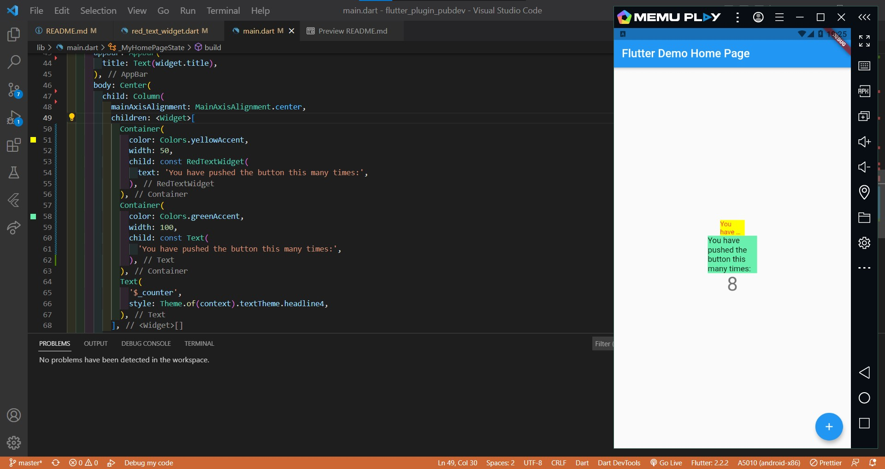

# flutter_plugin_pubdev

#22 | Pengenalan Plugin di Pub.Dev

## Langkah 2: Menambahkan Plugin

Tambahkan plugin `auto_size_text` menggunakan perintah berikut di terminal

## Langkah 3: Buat file red_text_widget.dart

Buat file baru bernama `red_text_widget.dart` di dalam folder lib 

## Langkah 4: Tambah Widget AutoSizeText

Ubahlah kode `return Container()` menjadi seperti berikut 
 
Terdapat error pada baris ke-8 karena method `AutoSizeText` tidak terdefinisi dan cara memperbaikinya yaitu dengan menambahkan `import 'package:auto_size_text/auto_size_text.dart';`. Lalu pada baris ke-9 error karena variabel `text` tidak terdefinisi dan akan diperbaiki pada langkah ke 5.

## Langkah 5: Buat Variabel text dan parameter di constructor

Tambahkan variabel text dan parameter di constructor seperti berikut 
 

## Langkah 6: Tambahkan widget di main.dart

Buka file `main.dart` lalu tambahkan di dalam `children:` pada class `_MyHomePageState` 
 

## Output

